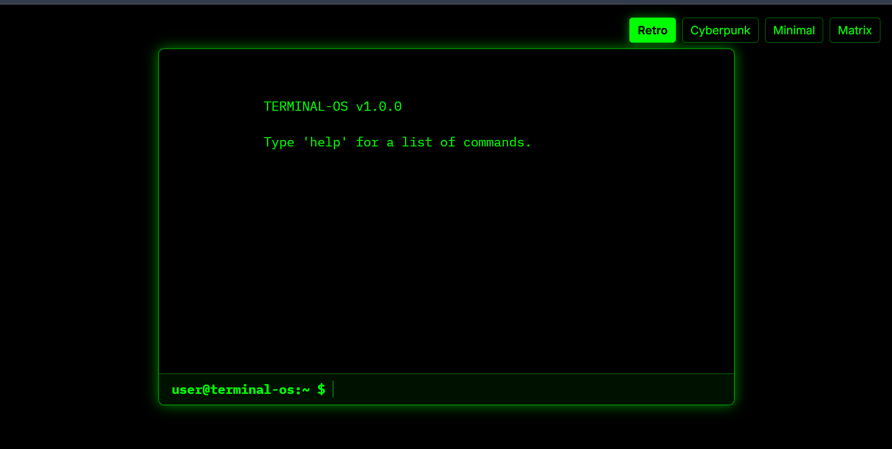
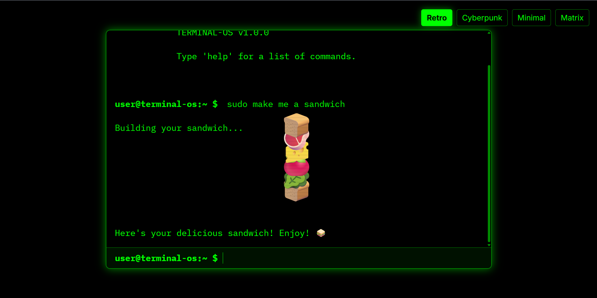
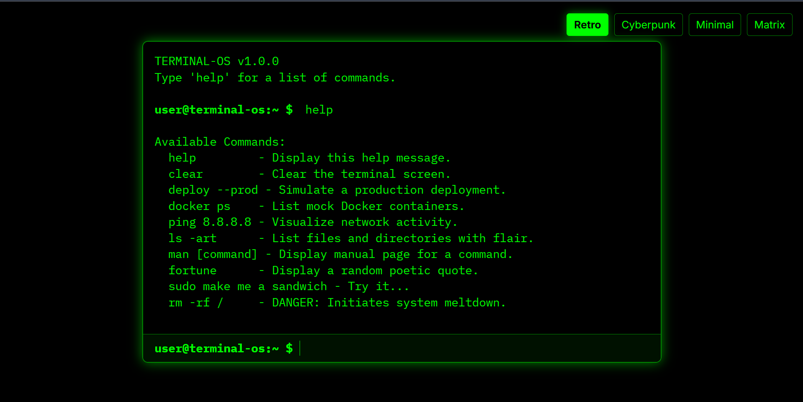
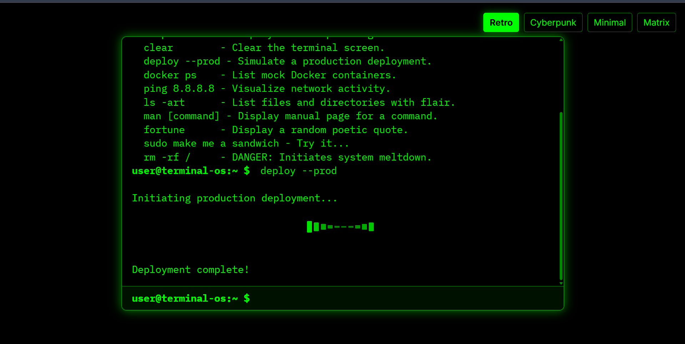
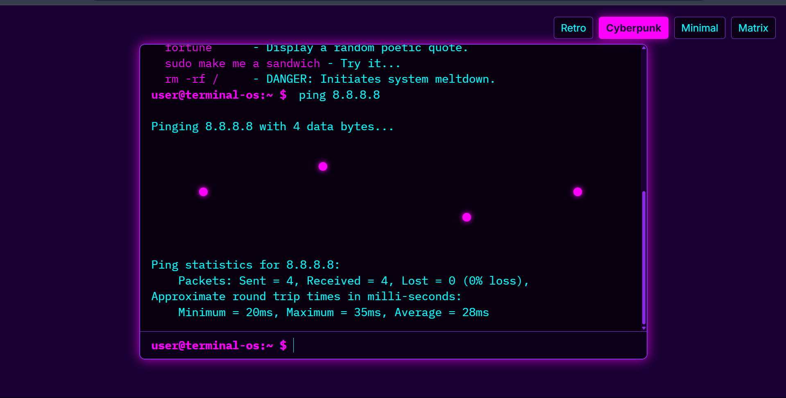

*This is a submission for [Frontend Challenge: Office Edition sponsored by Axero, Holistic Webdev: Office Space](https://dev.to/challenges/frontend/axero)*

---

## 💻 What I Built

I created **Terminal OS** — a fully frontend-only, visually creative and interactive **designer’s take on the command-line interface (CLI)**.

Terminal OS is not a real terminal, and that’s the point. It’s a **design-first, animation-rich, and imagination-driven experience** that reimagines what a modern terminal could look like if it was built for **visual storytelling**, **creative expression**, and **DevOps inspiration**.

Rather than focusing on functionality or management systems, Terminal OS focuses on showcasing:
- Animated CLI boot screens
- Stylized fake command responses
- ASCII art explosions
- Theme toggles (Retro, Cyberpunk, Minimal, Matrix)
- Glitch text effects, neon outputs, terminal sound FX
- Fun "easter egg" commands (`sudo`, `rm -rf /`, `fortune`)

Each command unlocks a different **visual and animated reaction**, allowing viewers to interact with the interface purely through design and creativity.

---

## 🎬 Demo

🌐 **Live Demo**: [https://terminalos.netlify.app/](https://terminalos.netlify.app/)  
📦 **GitHub Repo**: [https://github.com/prashantgohel321/Terminal-OS](https://github.com/prashantgohel321/Terminal-OS)

---

## 🛠️ Journey

I wanted to build something **unique, highly visual, and rooted in DevOps culture** — but without building a management tool or dashboard. That’s how the idea of Terminal OS came to life.

Instead of mimicking real terminal behavior, I designed it as a **fictional, interactive CLI OS**, where every command is a visual experience.

### Key Challenges & Fun Bits:
- Designing a fake parser to match input and play animations
- Creating glitch effects and retro CRT styles with pure CSS
- Making the boot-up animation feel real
- Adding fun fake commands like `sudo make me a sandwich` 🍞
- Building 4 themes with smooth transitions

### What I Learned:
- How to combine **design + animation + interactivity** in a single UI
- Using JavaScript to create smooth user feedback without real logic
- Creative storytelling through terminal aesthetics

---

Thanks to the DEV team and Axero for a challenge that let me break out of the "app" mindset and focus purely on **frontend creativity**.

